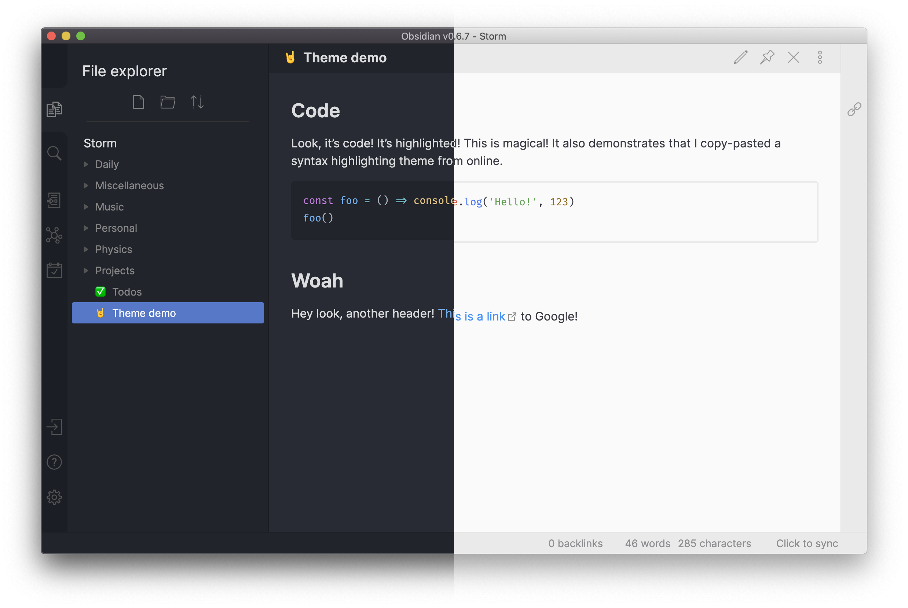

# Obsidian Atom

A theme for Obsidian based on Atom's One Dark and One Light themes.

Why?

- Close to Obsidian's default interface, but implements several tweaks to make the interface prettier
- Replaces the default ugly syntax highlighting theme for code blocks with a much nicer one

## Installation

1. In obsidian, click Settings -> Appearance -> Theme -> Manage
2. Search for "Atom" and click "Install and use"
3. Pick either light or dark theme in Obsidian's appearance settings!